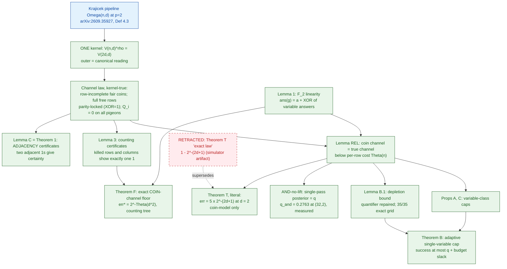
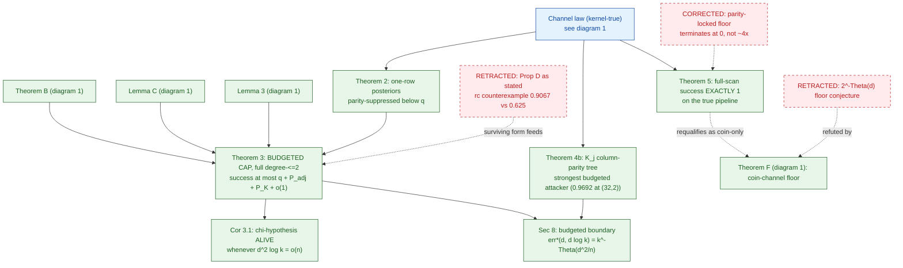
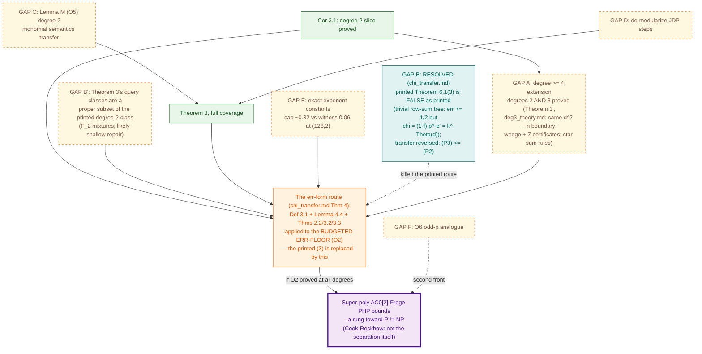

# Theorem dependency map: the p=2 program of arXiv:2609.35927 (v2, 2026-10-04)

Three focused diagrams: (1) foundations and the coin-channel layer, (2) the
true-pipeline theory, (3) the open gaps and the conditional route. Green = proved
and computation-verified; red dashed = retractions with provenance; yellow dashed =
open gaps; the route to the objective runs through Theorem 6.1's err-form assembly
(chi_transfer.md Theorem 4), since the printed chi-hypothesis (3) is false as
printed. Full retraction provenance in LOG.md; references in bibliography.md.

## 1. Foundations and the coin-channel layer

## 2. The true-pipeline theory (post-correction)

## 3. Open gaps and the conditional route (updated for chi-transfer)

## Notes

- The retraction chain, end to end: Theorem T's artifact law -> Prop D -> the
  2^{-Theta(d)} floor -> the ~4x parity-lock expectation -> the printed (3).
  Each is kept in LOG.md with full provenance; the four theorem-level ghosts
  appear in diagrams 1-2, the printed-(3) kill in diagram 3.
- GAP B resolved NEGATIVELY for the printed route and POSITIVELY for the corpus:
  the printed (3) is unprovable by any err-cap (reversed transfer) and false as
  printed; the err-form assembly is both correct and exactly what O2 targets.
- GAP A (degree >= 3) is the single remaining load-bearing gap: with it, the
  err-form route's premise is a proved theorem in the program's polylog regime.
- Validation: mmdc unavailable (disk 437 MB free at write time); each block
  passed the structural check (declared endpoints, quote balance, subgraph
  matching). `flowchart` renders on GitHub; no front matter is used inside the
  fences (some renderers reject YAML in fenced blocks).
